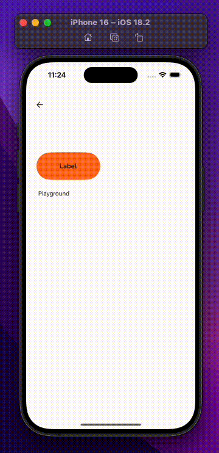

<div align="center">
  <h1 align="center">Component Story</h1>

  <div align="center">
     Para atender à necessidade de realizar QAs mais eficientes em componentes React Native, desenvolvi esta biblioteca. Ela facilita o entendimento, permitindo manipular ou alterar informações diretamente nos componentes. Trata-se de uma alternativa prática ao Storybook, que exige implementação individual para cada componente.  
  </div>  
<br/>     
  <div>
    
    
    
  </div>  
</div>
<br/><br/>

## 📋 <a name="table">Sumário</a>

1. 👔 [Exemplo](#exemplo)
2. 🍕 [Instalar](#instalar)
3. 💻 [Como usar](#como-usar)
4. ✏️ [Customizar Elementos](#customizando-elementos)
5. 🎤 [Types](./TYPES.md)
6. 📝 [Licença](./LICENSE.md)

<br/>

## <a name="exemplo">👔 Exemplo</a>



<br/>

## <a name="instalar">🍕 Instalar</a>

> Execute o comando abaixo para instalar o `ComponentStory`.

```js
npm i react-native-component-story
```

<br/>

## <a name="como-usar">💻 Como usar</a>

> Para utilizá-la, basta instanciar o `ComponentStory`, informar o componente a ser renderizado por meio da propriedade `renderItem` e adicionar os campos que serão manipulados. Confira um exemplo prático abaixo:

#### Exemplo simplificado

```js
import {ComponentStory} from "react-native-component-story";

<ComponentStory
  text={[{title: "label", value: "Label"}]}
  bool={[{title: "loading", value: false}]}
  renderItem={pg => (
    <Button
      onPress={() => pg.onPress("onPress", handlePress)}
      label={pg.getText("label")}
      loading={pg.getBool("loading")}
    />
  )}
/>;
```

#### Exemplo completo

```js
import { ComponentStory } from 'react-native-component-story';

// Define quantos campos de manipulação
// de texto serão criados.
const textList = [
  {title: 'label', value: 'Label', field: 'Label'}
]

// Define quantos campos de manipulação
// de booleanos serão criados.
const boolList = [
  {title: 'loading', value: false, field: 'loading'},
  {title: 'blocked', value: false, field: 'blocked'},
  {title: 'disabled', value: false, field: 'disabled'},
  {title: 'on brand', value: false, field: 'onBrand'},
]

// Define quantos campos de manipulação
// de `types` serão criados.
const typesList = [
  {
    title: 'icon',
    // define qual o valor o componente será inicializado.
    value: undefined,
    // adiciona uma lista de opções de ícones já instalados no projeto.
    list: [undefined,'pix','pin-drop','pill','photo-camera' ],
    fiedl: 'icon'
  },
]

<ComponentStory
  text={textList}
  bool={boolList}
  types={typesList}

  // Nome do componente que será mostrado ao gerar o código.
  componentName="Button"
  // Define se o `palco` do componente terá scroll.
  stageScrollEnabled={false}
  // O `pg` retorna todas as funções necessárias para buscar os valores definidos no ComponentStory. Veja as opções disponíveis [aqui](#istorycontextprops).
  renderItem={pg => (

    // O componente Button será renderizando criando os controles para manipulaçãp.
    // de propriedades conforme foram criados em cada um dos tipos.
    <Button
      onPress={() => pg.onPress('onPress', handlePress)}
      label={pg.getText('label')}
      loading={pg.getBool('loading')}
      blocked={pg.getBool('blocked')}
      disabled={pg.getBool('disabled')}
      onBrand={pg.getBool('on brand')}
      icon={pg.getType('icon') as any}
    />
  )}
/>
```

<br/>

## <a name="customizando-elementos">✏️ Customizando Elementos</a>

> Para personalizar os elementos do `ComponentStory`, basta incluir o `ComponentStoryThemeProvider` no início do seu projeto e configurar as propriedades de manipulação de cores conforme sua necessidade.

```js
import {ComponentStoryThemeProvider} from "react-native-component-story";

<ComponentStoryThemeProvider
  openButtonLabel="Abrir Playground"
  backgroundColor="red"
  textColor="#333"
  textColorSelected="blue"
  borderColor="green"
  borderRadius={500}
>
  // Componente que inicia sua aplicação ...
</ComponentStoryThemeProvider>;
```
